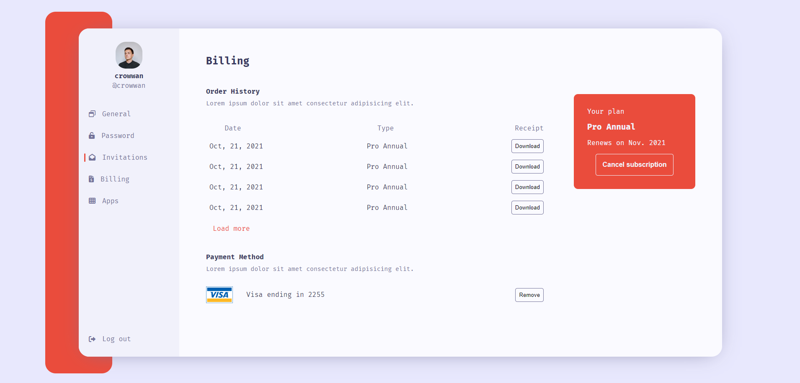

# Daily Web Practice

## 매일 웹 퍼블리싱 코딩 연습을 하기 위한 레포입니다.

주로 html, css로 이루어질 것이고, 필요하면 js를 사용하여 웹의 시각적인 요소와 기능을 구현하는 연습을 할 것이고, 완전한 서비스를 연습하는 것은 아닙니다.

제작과 관련하여 새롭게 알게된 것이나 정리가 필요한 내용은 저의 블로그를 참고해주세요.

https://velog.io/@crowwan

---

참고 사이트

https://uidesigndaily.com/license

---

### 1. Billing Page mock up

빌링 페이지 목업 이미지입니다.

반응형으로 제작했고 뷰포트에 따라 `aside` 내용을 줄이거나 오른쪽 `구독 정보 박스`를 없애는 식으로 구현했습니다.

좌측 네비게이션은 실제 동작하는 것처럼 보이기 위해 `radio input`을 이용했고, 실제로 아이콘과 글씨로 이루어진 `label`클릭 시 해당 `radio`가 체크되어 좌측에 바형태로 표시됩니다.

테이블의 경우 `hover`시 그림자를 주어 구분했습니다.

아이콘은 `font awesome`을 이용했습니다.
