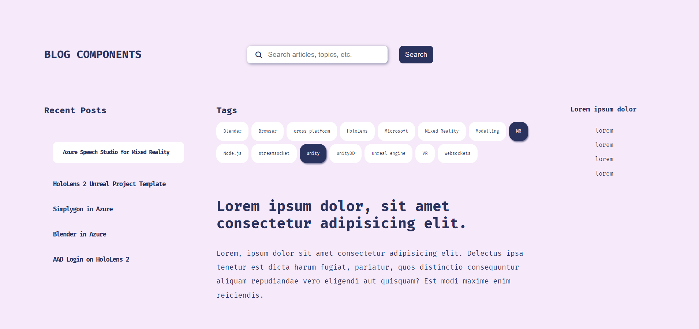
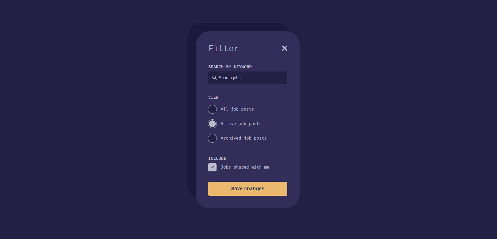

# Daily Web Practice

## 매일 웹 퍼블리싱 코딩 연습을 하기 위한 레포입니다.

주로 html, css로 이루어질 것이고, 필요하면 js를 사용하여 웹의 시각적인 요소와 기능을 구현하는 연습을 할 것이고, 완전한 서비스를 연습하는 것은 아닙니다.

제작과 관련하여 새롭게 알게된 것이나 정리가 필요한 내용은 저의 블로그를 참고해주세요.

https://velog.io/@crowwan

---

참고 사이트

https://uidesigndaily.com/license

---

### 1. Billing Page mock up

빌링 페이지 목업 이미지입니다.

반응형으로 제작했고 뷰포트에 따라 `aside` 내용을 줄이거나 오른쪽 `구독 정보 박스`를 없애는 식으로 구현했습니다.

좌측 네비게이션은 실제 동작하는 것처럼 보이기 위해 `radio input`을 이용했고, 실제로 아이콘과 글씨로 이루어진 `label`클릭 시 해당 `radio`가 체크되어 좌측에 바형태로 표시됩니다.

테이블의 경우 `hover`시 그림자를 주어 구분했습니다.

아이콘은 `font awesome`을 이용했습니다.

### 2. Blog components

블로그 페이지에서 사용될 태그 컴포넌트와 입력창, 네비게이션 컴포넌트에 대한 목업입니다.

미디어쿼리는 사용하지 않고, `vw`를 이용해서 반응형을 약간 구현했습니다. 포스트나 로고, 오른쪽 `aside`의 경우는 레이아웃을 위해 넣은 것입니다.

섹션을 구분할 수 있는 것이 없어서 최대한 여백을 이용했고, `box-shadow`를 이용해 조금 밋밋할 수 있는 페이지에 효과를 주었습니다.

배경색과 흰색 그리고 메인 색의 조화가 좋은 것 같지는 않습니다. 흰색이 붕 뜨는 느낌을 받았습니다. 특히 네비게이션에서 선택된 요소에 배경이 흰색이면 세련된 느낌이 없었습니다. 하지만 태그의 경우는 괜찮았던 것 같네요. 그래서 네비게이션을 수정하려고 그림자 효과를 넣었는데 별로 좋은 방법은 아닌 것 같아 폐기했습니다.

태그 버튼에서 선택된 태그들처럼 표현도 해보았지만, 태그와 다르게 네비게이션은 기본 배경이 흰색이 아니어서 오히려 선택된 요소가 눈에 안 들어오는 느낌이라 적용시키지 않았습니다.

네비게이션은 `radio input`으로 구현했고, 태그들은 `checkbox input`으로 구현했습니다.

스크롤은 문서 전체에서 보이지 않게 처리했습니다.

## 3. Filter Modal

필터 모달창입니다.

이전 목업들과 비슷하게 구현했는데 라디오 부분의 동그라미 요소를 `::after` 가상 선택자로 구현하면 쉬울 것이라 생각했지만, 정렬에 문제가 있었습니다.

> label태그에 `::after`를 통해 구현했을 때는 `lable`태그 다음에 요소가 생성되기 때문에 `position: absolute`가 불가피한데 이렇게 되면 글자와 가상 요소를 떨어뜨릴 때 `margin`이 적용이 안되고, `padding`의 경우 같이 적용되기 때문에 사용할 수 없었습니다.

이 문제는 처음 `div`를 글자 앞에 생성하는 방법을 시도해서 성공했지만, 생각해보니 `::before`를 사용하게 되면 `position:absolute`없이 요소가 왼쪽에 생기기 때문에 `margin`을 이용할 수 있을 것 같아 적용했더니 잘 작동하는 것을 확인했습니다.
